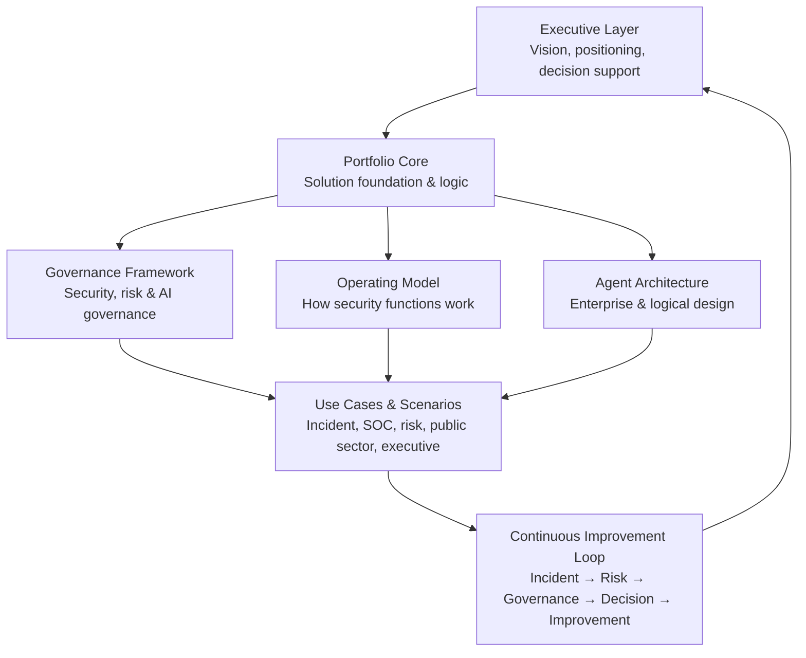

# Enterprise Security Governance AI

**Enterprise-oriented security solution and portfolio focused on building organizational security capability – from incident response to executive decision-making.**

This portfolio demonstrates how security operations, risk management and governance can be connected into a structured enterprise security model.

**Core flow:**  
`Incident → Risk → Governance → Decision → Improvement`

This repository is not a traditional software project. It is an **enterprise security portfolio** that brings together architecture, governance, operating models and applied use cases to demonstrate how modern security functions can be designed, governed and strengthened with controlled AI support.

---

## Why this portfolio exists

Many organizations today have strong technical security capabilities and established incident processes – but lack a structured bridge between:

- operational security work  
- organizational risk management  
- governance and leadership decision-making  

The result is that incidents and security observations often remain technical events instead of becoming long-term organizational improvement.

This portfolio explores how that gap can be closed.

---

## Start here

If you are new to this portfolio, start here:

- **00_EXECUTIVE_OVERVIEW**  
  → Executive overview, positioning, one-pager and portfolio navigation  
  *(What this solution is, why it exists and how to understand it)*

- **01_PORTFOLIO_CORE**  
  → Core concept, solution foundation and portfolio logic

- **02_GOVERNANCE_FRAMEWORK**  
  → Security governance, AI governance, risk and compliance structures

- **03_OPERATING_MODEL**  
  → How this solution supports security functions in practice

- **04_AGENT_ARCHITECTURE**  
  → Logical and enterprise architecture of the solution

- **05_USE_CASES**  
  → Incident, SOC, risk, public sector and executive scenarios

- **06_INTERVIEW_MATERIAL**  
  → Interview support material, pitch assets and executive explanations

- **07_WORKLOG_AND_PLANS**  
  → Project evolution, design decisions and roadmap

- **08_ARCHIVE**  
  → Historical material and previous versions

---

## Portfolio structure overview

## What this portfolio demonstrates

This portfolio demonstrates how an enterprise security capability can be built by connecting:

- incident handling and operational security  
- organizational risk and maturity analysis  
- governance and control structures  
- executive and decision support  
- controlled and traceable AI usage in security work  

It focuses on **structure, governance and decision-support, not automation.**

---

## Core security capabilities

### Incident-to-Governance  
Structured transfer from security events to governance and improvement.

### Organizational Security Analysis  
Risk, gap and maturity assessments on organizational level.

### Executive & Decision Support  
Coherent risk pictures, prioritization support and management material.

### SOC & Operational Support  
Incident analysis, triage support and quality-assured documentation.

### AI Governance & Control Layer  
Controlled, traceable and risk-based AI usage in security functions.

---

## Who this portfolio is for

This portfolio is designed to support and reflect roles such as:

- Informations- och IT-säkerhetssamordnare  
- SOC and incident response functions  
- Risk and GRC roles  
- CISO and security management support  
- Leadership and organizational security functions  

It is especially relevant for **enterprise environments, public sector, regulated organizations and critical functions.**

---

## How to use this repository

This repository can be used as:

- an executive-level security portfolio  
- a design reference for enterprise security capability  
- a foundation for incident-to-governance models  
- a discussion base in security leadership and architecture work  
- an interview and professional portfolio  
- a controlled exploration of AI-supported security analysis  

It is built to be **navigated, not executed.**

---
## How organizations use this solution in regulated environments

This portfolio is designed to support enterprise and regulated organizations in developing security capability without exposing sensitive operational or incident data.

The solution can be used safely and effectively to support:

• governance design and maturity work
• incident-to-governance analysis models
• leadership discussions and decision preparation
• risk and control framework alignment
• controlled AI-supported analysis in non-production contexts

Organizations can apply this structure using:

• anonymized or synthetic scenarios
• tabletop and exercise-based cases
• historical or red-team material
• policy, audit and governance inputs
• architectural and capability assessments

This enables organizations to work with the model without processing live personal data, operational secrets or regulated incident content.

## Regulatory and compliance alignment

The portfolio is designed to align with enterprise regulatory and governance needs, including:

• NIS2 – by supporting management accountability, incident-to-risk translation, governance structures and continuous improvement
• GDPR – by enabling security governance and risk work without requiring personal data processing
• ISO/IEC 27001 & 27002 – by mapping operational security work to governance, risk management and control ownership
• ISO/IEC 27035 – by extending incident management into organizational learning and leadership decision-making
• DORA and sector regulations – by supporting resilience, control validation and executive-level risk understanding

The solution focuses on capability, structure and governance, not on collecting or automating operational security data.

## Controlled AI usage

When AI is used, it is positioned as:

• decision-support, not automation
• structured analysis, not free-form chat
• governance-controlled, not consumer AI
• human-in-the-loop by design

This enables organizations to explore AI-supported security analysis in a way that supports regulatory expectations on:

• traceability
• accountability
• data minimization
• and management oversight.

##

## Positioning

This portfolio demonstrates how enterprise security capability can be developed by systematically connecting technology, risk, governance and decision-support – adapted for both Swedish public sector and larger private organizations.

It reflects a governance-first, risk-based and human-in-the-loop approach to modern security work.

---

## Status

This portfolio is under active development and continuously refined as an enterprise security design and learning project.
